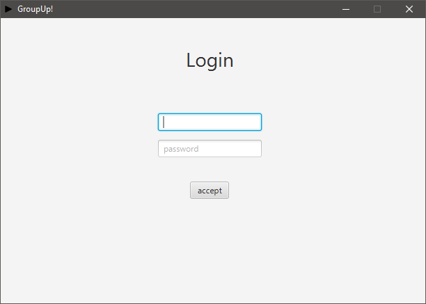
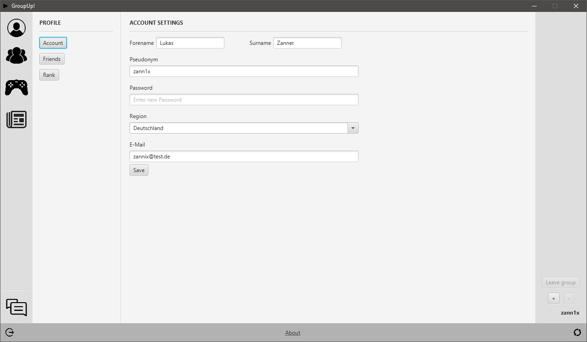
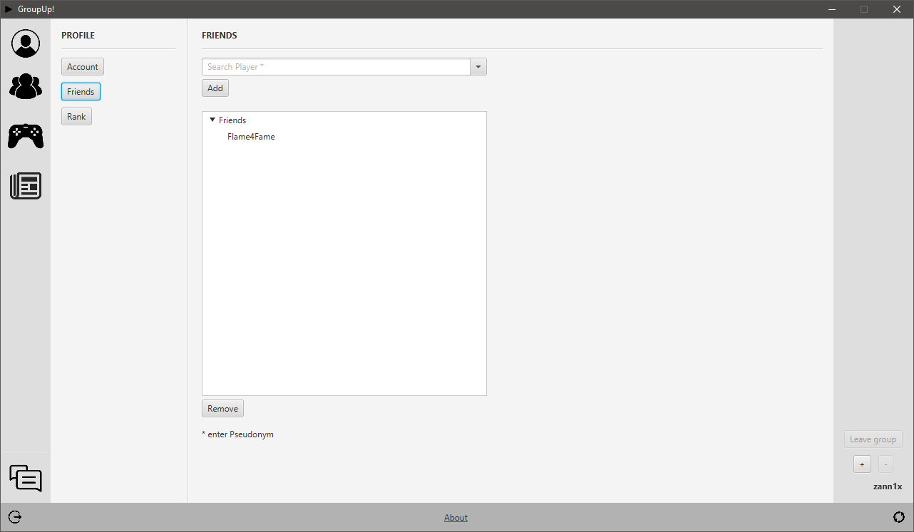
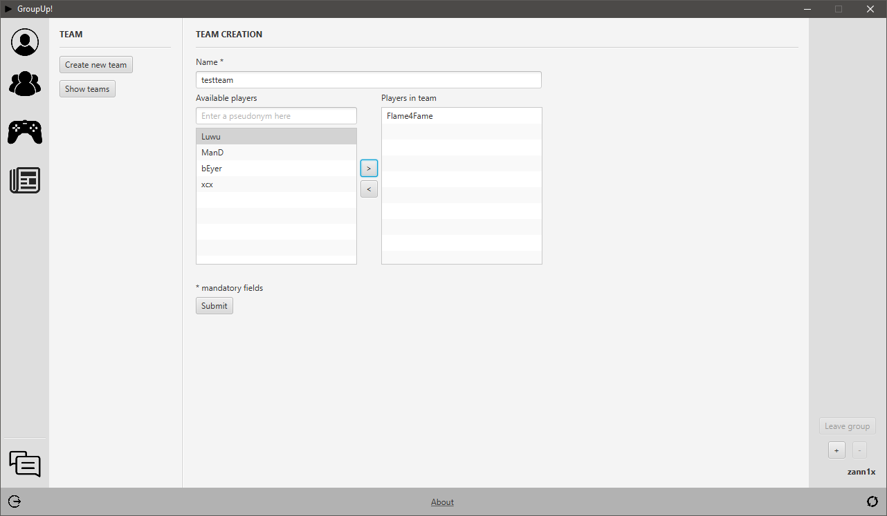
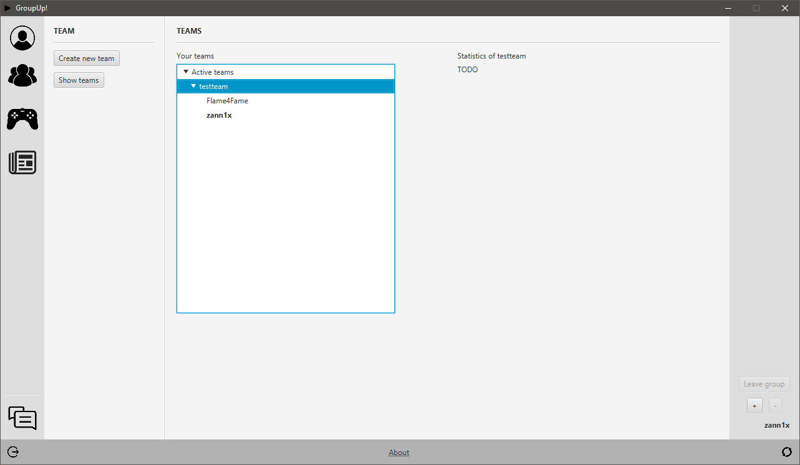
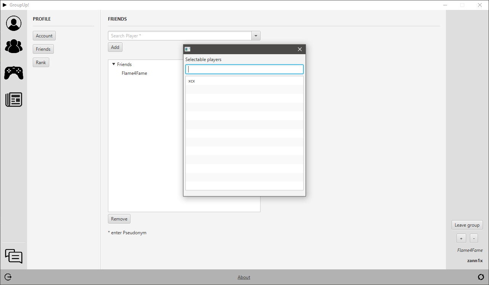

# GroupUp

This is project is based on a project at university. The key idea was to create a group-/teammate-finder based on the skill and other various other attributes of registered players (compare to FACEIT or ESEA).
Only some very basic features were implemented during the course as most of the work was done conceptually on paper. Implemented features are the creation of teams and groups as well as adding friends to your friendlist.

## Getting up and running

- Start a local MySQL database server with e.g. XAMPP.
- Import the *GroupUp.sql* file found in the db_migration folder into your database.
- Start the application.
- Login with e.g. username "zann1x" and password "test".

